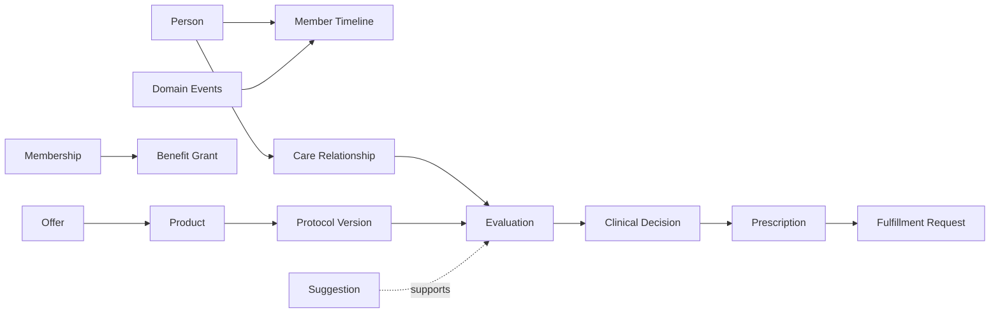

# 03 — Core Object Model

**Status:** Foundation Draft  
**Owner:** Platform Architecture

## Purpose

Define the small set of cross-domain object patterns required for identity,
ownership, provenance, versioning, and longitudinal reconstruction.

## Principles

- Every canonical object has one owning domain.
- Identifiers are stable and meaning-free.
- Business identity is separate from external-system identifiers.
- Recorded time, effective time, and occurrence time are distinct.
- Material records are attributable and reconstructable.
- Cross-domain references do not grant write authority.

## Canonical Objects

### Shared object patterns

| Object | Owner | Required semantics |
| --- | --- | --- |
| Canonical Record | Owning domain | Stable ID, created time, provenance, lifecycle identity |
| Versioned Definition | Owning domain | Stable definition ID, immutable version ID, version number, effective interval, status |
| External Identifier | Identity or owning domain | System, value, validity interval, verification state |
| Actor Context | Identity | Actor, principal, organization, role, delegated authority, purpose of use |
| Provenance | Memory | Source, author or device, recorded time, method, lineage |
| Assertion | Memory | Subject, predicate, value, author, confidence or verification state, effective interval |
| Timeline Event | Memory | Member, event type, occurrence time, source reference, visibility classification |
| Domain Event Envelope | Publishing domain | Event ID, type and version, aggregate ID, occurred and recorded times, actor context, correlation and causation IDs |

### Domain roots

| Domain | Initial aggregate roots |
| --- | --- |
| Identity | Person, Account, Organization, Care Team, Consent Grant, Actor Role Assignment |
| Memory | Member Timeline, Assertion Set, Source Artifact, Provenance Record |
| Clinical | Care Relationship, Protocol Definition, Evaluation, Clinical Decision, Treatment Plan, Prescription |
| Commerce | Product, Offering, Offer Definition, Price Definition, Membership, Benefit Grant, Order, Payment Intent |
| Operations | Workflow Instance, Work Item, Fulfillment Request, Routing Decision, Partner Assignment |
| Intelligence | Suggestion, Evidence Set, Review Decision, Model Release, Automation Policy |

An aggregate boundary represents a consistency and authority boundary, not a
promise that all data lives in one table or service.

## Relationships

References to definitions MUST resolve to a specific immutable version whenever
that version influenced an outcome.

## Business Rules

### Identity

- A Person MUST NOT be merged or split without an auditable identity-resolution
  decision and reversible lineage.
- Authentication changes MUST NOT change clinical identity.
- All privileged changes MUST include an Actor Context.

### Time

- `occurredAt` represents when the real-world event occurred.
- `recordedAt` represents when HealthOS persisted the record.
- `effectiveFrom` and `effectiveTo` represent when a definition or assertion
  applies.
- Unknown or estimated time MUST be represented explicitly, not fabricated.

### Versioning and correction

- Published definition versions are immutable.
- A correction creates a superseding record linked to the superseded record.
- A decision stores references to the exact policy versions and material inputs
  used at decision time.
- Retraction changes the trust or applicability of an assertion without erasing
  the fact that it was previously asserted.

### Cross-domain integrity

- A domain consumes another domain's facts by identifier and published contract.
- A downstream projection MAY be rebuilt and MUST NOT become a second source of
  truth.
- Distributed side effects use idempotency keys and durable publication semantics.

## State Machines

Versioned Definitions follow `draft → approved → active → retired`, with an
optional `withdrawn` terminal state for versions that must not become active.
Domain-specific lifecycles are defined in their owning chapters.

## Events

Every published event MUST include:

- globally unique event ID;
- versioned event type;
- owning domain and aggregate identity;
- occurrence and recording timestamps;
- correlation and causation IDs;
- Actor Context or an explicit system actor;
- sensitivity classification and schema reference.

Events MUST be immutable. Corrections are new events.

## Permissions

- Object mutation is authorized by the owning domain.
- Read access is evaluated using actor, subject, organization, purpose of use,
  consent, jurisdiction, and data sensitivity where applicable.
- Emergency or break-glass access MUST be explicit, time-bound, and reviewed.

## Configuration

Configuration is represented as a Versioned Definition when it can affect a
member, clinical, commercial, financial, or operational outcome. Draft editing
MAY be mutable; approval publishes an immutable version.

## Acceptance Criteria

- Every object names its owner and stable identifier.
- Every outcome can identify the definition versions that governed it.
- Corrections preserve original content and lineage.
- Time semantics are explicit and timezone-safe.
- Cross-domain writes occur only through owned interfaces.
- Event consumers can process duplicates safely.

## Future Extensions

- Formal bitemporal storage patterns.
- Global subject and organization resolution across acquired platforms.
- Standardized FHIR resource mappings without making FHIR the internal domain
  model.

## Anti-Patterns

- Shared database tables writable by multiple domains.
- Foreign keys to mutable “current” configuration for historical decisions.
- Hard deletion as the normal correction mechanism.
- Treating an event bus as object ownership.
- Using an email address or partner ID as the canonical person ID.

## Open Decisions

- ULID, UUIDv7, or another canonical identifier format.
- Required precision and policy for estimated clinical occurrence times.
- The boundary between Source Artifact storage and specialized media storage.

