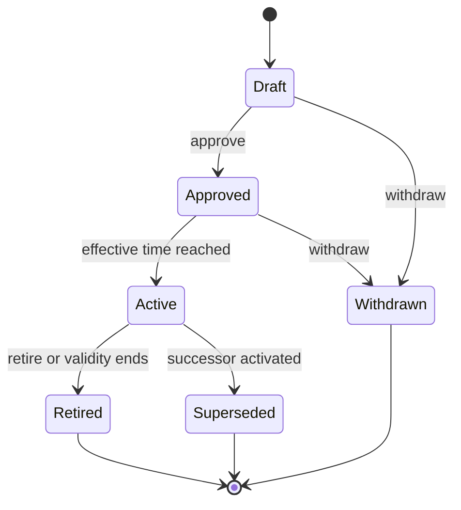
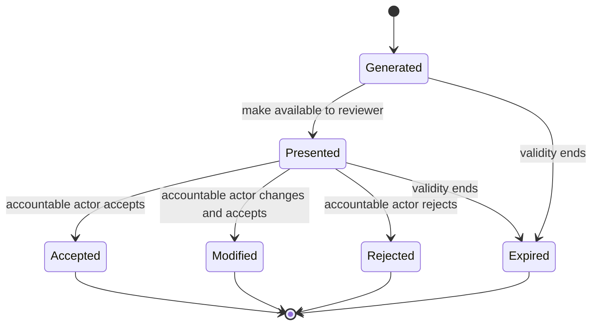

# 04 — State Machines

**Status:** Foundation Draft  
**Owner:** Platform Architecture

## Purpose

Define common lifecycle semantics so workflows remain explicit, auditable, and
safe across domains.

## Principles

- State represents a durable business fact, not a UI step.
- Transitions occur through named commands and emit facts.
- Authorization and invariants are evaluated at transition time.
- Terminal does not mean deleted.
- Failure, cancellation, expiration, and supersession are distinct.
- Clinical and commercial lifecycles do not collapse into one machine.

## Canonical Objects

| Object | Meaning |
| --- | --- |
| State Machine Definition | Versioned set of states, transitions, guards, and terminal conditions |
| Transition Attempt | Attributed request to perform a transition |
| Transition Record | Accepted state change with prior state, new state, reason, actor, and policy version |
| Guard Result | Explainable evaluation of a transition prerequisite |
| State Projection | Rebuildable current-state view derived from transition history |

## Relationships

A domain aggregate owns its state machine. A workflow may coordinate multiple
aggregates, but it MUST NOT replace their independent lifecycles with a shared
status field.

## Business Rules

- Each transition MUST define allowed source states, target state, authorized
  actors, guards, emitted event, and idempotency behavior.
- Rejected attempts SHOULD record safe diagnostic context when operationally or
  clinically material.
- State history MUST be append-preserving.
- A transition requiring clinical authority MUST NOT be completed by a commercial
  workflow actor.
- Time-driven transitions use an explicit effective time and scheduler identity.
- Rollback is modeled as a compensating transition; history is not rewritten.

### Shared lifecycle vocabulary

| State | Meaning |
| --- | --- |
| Draft | Editable and not authoritative |
| Pending | Awaiting a named prerequisite or decision |
| Active | Currently effective for its defined purpose |
| Suspended | Temporarily prevented from normal use; may resume |
| Completed | Intended lifecycle outcome reached |
| Cancelled | Stopped intentionally before completion |
| Expired | Ended because its validity interval elapsed |
| Superseded | Replaced by a specifically linked successor |
| Failed | Unable to complete due to an unrecovered error |
| Withdrawn | Removed from future use by its authority before activation |

These words MUST be qualified by an aggregate-specific definition before use.

## State Machines

### Versioned definition

### Reviewable suggestion

Accepting a suggestion creates an independently attributable decision; the
suggestion itself never becomes the decision.

## Events

Transitions emit past-tense domain facts. Generic `statusChanged` events SHOULD
be avoided at public boundaries. Events include transition reason, policy
version, actor context, and prior and resulting state when disclosure is safe.

## Permissions

Permission is transition-specific. Read access to current state does not imply
permission to transition it. Delegated and automated transitions MUST identify
their granting policy.

## Configuration

Workflow routing MAY be configured. Clinical decision authority, legal
constraints, audit requirements, and forbidden transitions are code- and
policy-enforced safety boundaries and cannot be weakened by commercial config.

## Acceptance Criteria

- No canonical aggregate relies on an undocumented free-form status.
- Each transition has an owner, guard, authority, reason, and emitted fact.
- Duplicate commands cannot create duplicate effects.
- Compensations preserve the original transition history.
- Independent domain lifecycles can fail or progress independently.

## Future Extensions

- Machine-readable state-machine definitions and conformance tests.
- Temporal logic checks for safety and liveness invariants.
- Standard human-task escalation and service-level policies.

## Anti-Patterns

- Boolean fields for multi-step lifecycles.
- One checkout state representing clinical, payment, and fulfillment state.
- Editing a state-history row to “fix” an error.
- Allowing any administrator to perform every transition.
- Hiding unknown or inconsistent state behind `active`.

## Open Decisions

- OD-012 — OPEN — ENGINEERING
- OD-013 — OPEN — COMPLIANCE

Definitions and disposition are centralized in the
[Open Decision Register](../OPEN-DECISIONS.md).
