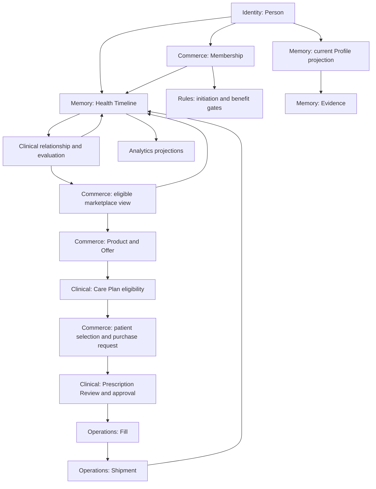
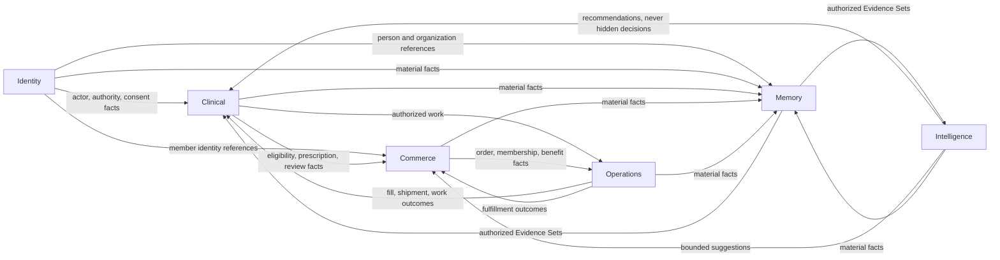
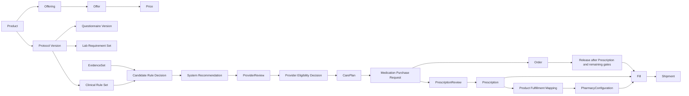
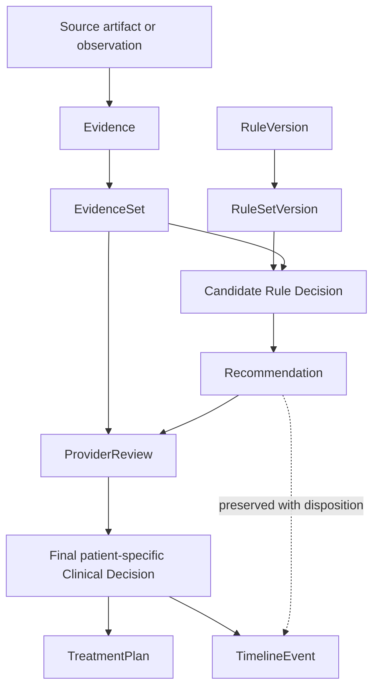
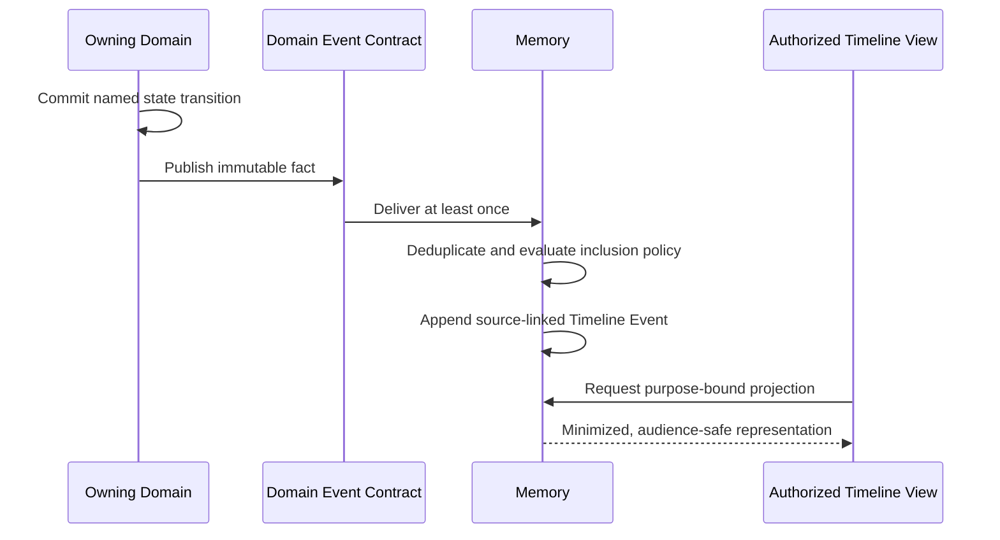
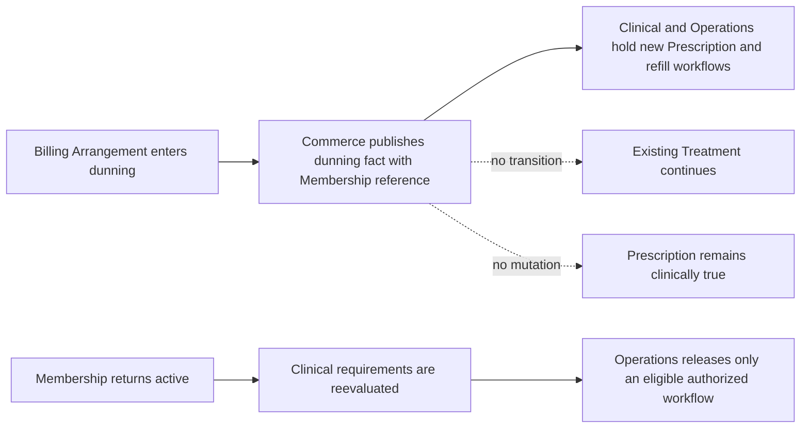

# Package 003 Domain Relationship Diagrams

**Status:** Conceptual and logical views; implementation topology not implied

## Longitudinal relationship

Arrows indicate governed relationships or published facts, not write ownership.
Marketplace presentation does not authorize Treatment, and purchase does not prove
Treatment initiation.

## Bounded-context contracts

## Product-to-care-to-fulfillment

## Rule decision and evidence lineage

## Event-to-Timeline projection

## Membership dunning invariant

## Diagram conventions

- Solid arrows mean a direct canonical relationship or consumed contract.
- Dotted arrows mean supporting, non-authoritative, or explicitly absent mutation.
- Nodes use `<Domain>: <Object>` where ownership could be ambiguous.
- Diagrams are conceptual unless explicitly marked logical or sequential.
- Textual invariants override layout; diagrams never supersede owning specifications.
